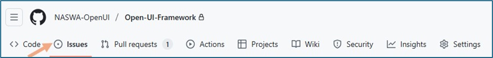
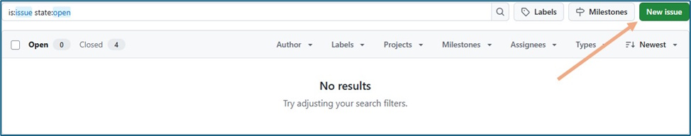
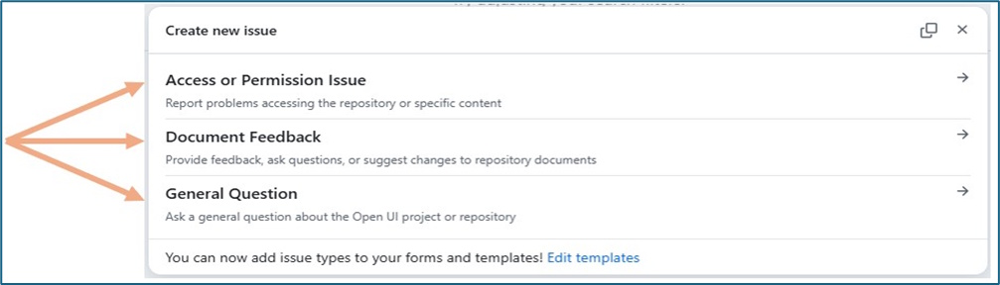

# Contributing Guidelines

If you have additional questions or are interested in learning about more ways to work with the Open UI Initiative, please email us at [openui@naswa.org](mailto:openui@naswa.org). You can also visit our [website](https://www.naswa.org/open-ui-initiative) for more information about the Open UI Initiative. 

Please review our [Code of Conduct](https://github.com/NASWA-OpenUI/Open-UI-Framework/blob/578fe338c2d225291c0f16338d57cec465c7a7f1/Contribution%20Guidelines/CODE_OF_CONDUCT.md) before submitting feedback.

 

## Table of Contents
1. [How to Submit Feedback](#how-to-submit-feedback)
2. [GitHub Terms and Usage Guide](#github-terms-and-usage-guide)

 

## How to Submit Feedback
If you have specific feedback to provide about content in the Framework Repository, such as feedback or a suggestion for a specific module specification, please follow the instructions below on how to submit feedback via an Issue. You can view our [Release Log](https://github.com/NASWA-OpenUI/Open-UI-Framework/blob/578fe338c2d225291c0f16338d57cec465c7a7f1/ReleaseLog.md) for an overview of updates and changes the Open UI team has made to the content in this repository.

### Introduction

The Open UI GitHub repository is a central hub for documentation and
collaboration. Your feedback plays a key role in helping us improve
these resources. This guide outlines how to submit feedback to ensure
your input is effectively captured and reviewed by the Open UI team.

The simplest path to submit feedback is by creating a GitHub **Issue**.
While items submitted might not be an actual issue or problem, it is how
GitHub consolidates user feedback related to the Open UI repo. The
following guidelines will walk you through how to create an issue, use
predefined templates for ease of creation, and further manage the ticket
and provide updates via email.

### How to Submit Feedback via an Issue

1.  **Open the Issues tab**

    - Click the “Issues” tab at the top of the repository page

<b><i>Figure 1: Issue Tab</i></b>

2.  **Create a new issue**

    - Click the green “New issue” button

<b><i>Figure 2: New Issue Button</i></b>

3.  **Select an issue template**

    - Choose the appropriate template for your feedback:

      - **Access or Permission Issue**: For problems accessing content

      - **Document Feedback**: For comments or suggestions about
        specific documents

      - **General Question**: For inquiries not related to specific
        documents

<b><i>Figure 3: Template Options</i></b>

4.  **Complete the template**

    - While templates vary based on topic, they have some common
      elements:

        - **Title** - Give your issue a descriptive title that communicates at a glance what your feedback is about.

        - **Sub Issue/Question Type** - Select what kind of feedback you are providing.

        - **Issue/Question Details** - Provide the details of your feedback here.

      - Optional fields – noted with an (optional) prefix

        - **Suggestions for change** - Provide any suggestions or ideas on how to implement your feedback.

    - Please be specific to help us address your feedback efficiently

    - If you are unsure about any field, please reach out to our team
      for help at openui@naswa.org and we will follow up with you

5.  **Submit your issue**

    - Review the information you provided for completeness

    - Click the “**Create**” button

<b><i>Figure 4: Create New Issue Button</i></b>

- You’ll be redirected to a GitHub page with a summary of your issue

 

<b><i>Figure 5: Issue Confirmation Screen</i></b>

- This confirms that your issue has been successfully opened. It is
  informational and no further action is needed at this stage.

- You will also receive a confirmation email with a link to review the
  issue and add further comments throughout the resolution process.

### Managing Your Issue

#### Email Notifications

GitHub automatically sends notifications to your email address when:

- Your issue is created

- Someone comments on your issue

- The status of your issue changes

#### Responding to Updates

You can manage your issue entirely through email:

- Reply directly to any notification email

- Your reply will automatically be added as a comment to the GitHub
  issue

- You don’t need to log back into GitHub to continue the conversation

#### Adding More Information

If you need to provide additional details after submitting:

- Reply to any notification email about your issue

- Your response will be added as a comment

- You can attach files if needed

### What Happens After Submission

After you submit an issue:

1.  **Acknowledgment**: You’ll receive an automatic confirmation

2.  **Review**: The Open UI team will review your feedback

3.  **Updates**: You’ll receive email notifications about progress

4.  **Resolution**: You’ll receive a final response explaining the
    outcome

### Best Practices for Effective Feedback

To help us address your feedback efficiently:

- **Be specific**: Clearly identify what your feedback relates to

- **Provide context**: Explain why you’re submitting the feedback

- **Suggest solutions**: When possible, offer potential solutions

- **Include examples**: Use examples to illustrate your points

- **Be concise**: Focus on key information

### Additional Help

If you encounter any difficulties with this process, please contact
<openui@naswa.org> for assistance.

 

## GitHub Terms and Usage Guide

### Branch
Create your own workspace to make changes without affecting what others see. This lets you draft and experiment safely.

> **Example:** "I want to update a process document → I'll create a separate **branch** to work on my changes"

### Comment
Provide feedback, ask questions, or suggest edits on specific parts of documents.

> **Example:** "I have a suggestion about this paragraph → I'll add a **comment** to that specific section"

### Clone
Download a copy of the repository to your computer to work on files locally.

> **Example:** "I need to make several document updates → I'll **clone** the repository to my computer"

### Commit
Save your changes with a brief description of what you modified and why.

> **Example:** "I've finished updating the contact list → I'll **commit** these changes with a note explaining what I updated"

### Draft Pull Request
Work on changes and get early feedback before they're ready for final review.

> **Example:** "I've started updating the process guide but want early input → I'll create a **draft** PR to share my progress"

### Fork
Create your own copy of the repository that you can freely modify.

> **Example:** "I want to propose changes to our documentation → I'll **fork** the repo to work on my ideas"

### Issues
Start or join discussions about specific topics, track tasks, or suggest improvements.

> **Example:** "I noticed our FAQ needs updating → I'll open an **issue** to discuss this with the team"

### Labels
Add categories or status indicators to issues and pull requests to keep things organized.

> **Example:** "This document needs legal review → I'll add the 'legal-review' **label** so the right team sees it"

#### Markdown (.md files)
The formatting language used in GitHub to create text documents with headers, lists, and other styling using simple symbols.

> **Example:** "I need to make this text bold → I'll add \*\* before and after the text in a **markdown** file"

#### Merge
Combine approved changes from a pull request into the main document.

> **Example:** "The team has approved my updates → they will **merge** my changes into the main branch"

### Milestone
A way to group related issues or pull requests together to track progress toward a goal or deadline.

> **Example:** "These updates are for our Q2 release → I'll add them to the Q2 Documentation **milestone**"

### Projects
A way to view and organize work across multiple documents or tasks in a board-style layout.

> **Example:** "I want to see all documentation tasks in one place → I'll check our team's **Project** board."

### Pull Request (PR)
Share your proposed changes with the team and gather feedback before making them official.

> **Example:** "I've finished my document updates → I'll create a **pull request** so my changes can be reviewed"

### README
A file where that contains essential information about the repository and how to use it.

> **Example:** "I'm new to this project → I'll check the README for guidance on getting started."

#### Repository (Repo)
This is where you'll go to find, view, and work with all your team's documents and files. It is the team's shared workspace.

> **Example:** "I need to find the latest version of our style guide → I'll check our team's **repository**"

#### Sync/Pull
Update your local copy with any changes others have made in the repository.

> **Example:** "Before I start working → I'll **sync** my branch to get the latest updates"

#### Watch
Get notifications about changes or discussions in specific documents or areas you care about.

> **Example:** "I need to stay updated on changes to the compliance docs → I'll **watch** that folder"
