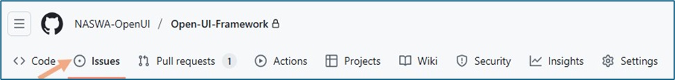
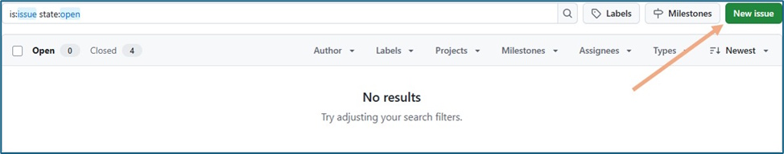
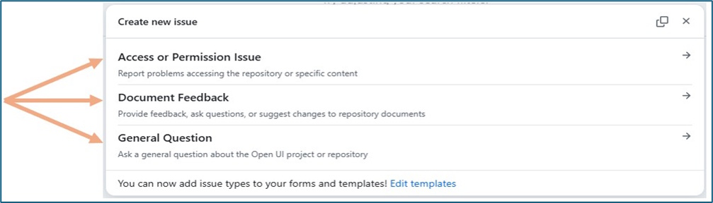
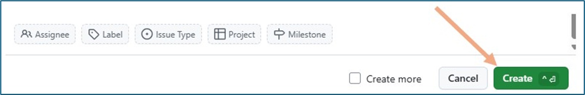
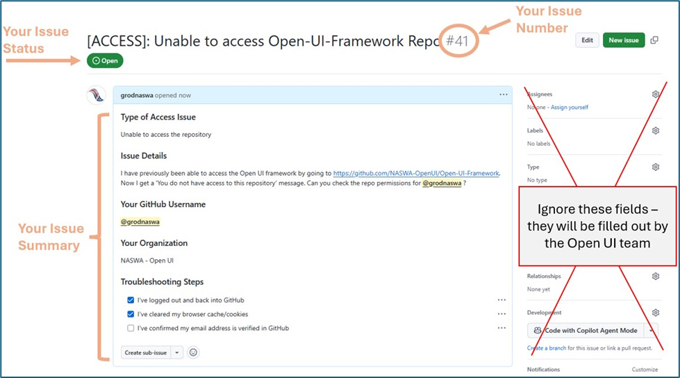

# Introduction

The Open UI GitHub repository is a central hub for documentation and
collaboration. Your feedback plays a key role in helping us improve
these resources. This guide outlines how to submit feedback to ensure
your input is effectively captured and reviewed by the Open UI team.

The simplest path to submit feedback is by creating a GitHub **Issue**.
While items submitted might not be an actual issue or problem, it is how
GitHub consolidates user feedback related to the Open UI repo. The
following guidelines will walk you through how to create an issue, use
predefined templates for ease of creation, and further manage the ticket
and provide updates via email.

# How to Submit an Issue

1.  **Navigate to the Open UI Framework repository**

    - Use the
      [Open-UI-Framework](https://github.com/NASWA-OpenUI/Open-UI-Framework)
      link to access the repo

      - If you get a permission error message, please complete the [Open
        UI Repo Access Request
        Form](https://forms.office.com/Pages/ResponsePage.aspx?id=wgcnrwjKGE-noLkKj608dgOZ_Szh0_5OsCziloIAKrpURUo3N0FMMEZGSkhGOVpMR0pDTEw5WFZCWi4u)
        to request access

      - For any other issues, please contact <openui@naswa.org>

2.  **Open the Issues tab**

    - Click the “Issues” tab at the top of the repository page

Figure 1: Issue Tab

3.  **Create a new issue**

    - Click the green “New issue” button

Figure 2: New Issue Button

4.  **Select an issue template**

    - Choose the appropriate template for your feedback:

      - **Access or Permission Issue**: For problems accessing content

      - **Document Feedback**: For comments or suggestions about
        specific documents

      - **General Question**: For inquiries not related to specific
        documents

Figure 3: Template Options

5.  **Complete the template**

    - While templates vary based on topic, they have some common
      elements:

      - Required fields – noted by an **\*** symbol

        - **Title**

        - **Sub Issue/Question Type**

        - **Issue/Question Details**

      - Optional fields – noted with an (optional) prefix

        - **Suggestions for change**

    - Please be specific to help us address your feedback efficiently

    - If you are unsure about any field, leave it blank and our team
      will follow up

6.  **Submit your issue**

    - Review your information for completeness

    - Click the “**Create**” button

Figure 4: Create New Issue Button

- You’ll be redirected to a GitHub page with a summary of your issue

- This
  confirms that your issue has been successfully opened. If it’s
  informational and no further action is needed at this stage, no
  additional steps are required.

Figure 5: Issue Confirmation Screen

- You will also receive a confirmation email with a link to review the
  issue and add further comments throughout the resolution process.

# Managing Your Issue

## Email Notifications

GitHub automatically sends notifications to your email address when:

- Your issue is created

- Someone comments on your issue

- The status of your issue changes

## Responding to Updates

You can manage your issue entirely through email:

- Reply directly to any notification email

- Your reply will automatically be added as a comment to the GitHub
  issue

- You don’t need to log back into GitHub to continue the conversation

## Adding More Information

If you need to provide additional details after submitting:

- Reply to any notification email about your issue

- Your response will be added as a comment

- You can attach files if needed

# What Happens After Submission

After you submit an issue:

1.  **Acknowledgment**: You’ll receive an automatic confirmation

2.  **Review**: The Open UI team will review your feedback

3.  **Updates**: You’ll receive email notifications about progress

4.  **Resolution**: You’ll receive a final response explaining the
    outcome

# Best Practices for Effective Feedback

To help us address your feedback efficiently:

- **Be specific**: Clearly identify what your feedback relates to

- **Provide context**: Explain why you’re submitting the feedback

- **Suggest solutions**: When possible, offer potential solutions

- **Include examples**: Use examples to illustrate your points

- **Be concise**: Focus on key information

# Additional Help

If you encounter any difficulties with this process, please contact
<openui@naswa.org> for assistance.
